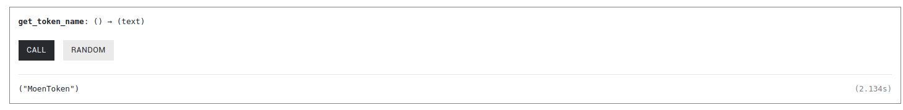

# TOKEN CREATION ON ICP USING ICRC1 LEDGER (Locally) 

Follow the steps below: 

### Step 1: Create a new project
```
dfx new my_token_name
```

### Step 2: Fetch the candid and wasm files for the icrc1 ledger canister: 
Using the command
```
curl -o download_latest_icrc1_ledger.sh "https://raw.githubusercontent.com/dfinity/ic/326df23607fc8280a047daba2d8462f1dfc57466/rs/rosetta-api/scripts/download_latest_icrc1_ledger.sh"
chmod +x download_latest_icrc1_ledger.sh
./download_latest_icrc1_ledger.sh
```

### Step 3: Configure your dfx to contain the fetched wasm and candid files: 
```
"icrc1_ledger_canister": {
  "type": "custom",
  "candid": "icrc1_ledger.did",
  "wasm" : "icrc1_ledger.wasm.gz"
}
```

### Step 4: Locate the ``setup.sh`` file and configure your token details 
Check out the comments in the ``setup.sh`` file and configure the different details of your token 

### Step 5: Deploy the ``icrc1 ledger`` canister locally using the command: 
``` 
./setup.sh 
```

If it tells you permission denied run the command 
```
chmod +x ./setup.sh 
```

### Step 5: Interacting with the ICRC1 Ledger through inter canister calls: 
The next step is to interact with the locally deployed ledger through inter canister calls 

Go to the ``lib.rs`` file  and make some changes 
```
use candid::Principal; 
use ic_cdk::update; 

#[update]
async fn get_token_name() -> String {
    let ledger_id = Principal::from_text("mxzaz-hqaaa-aaaar-qaada-cai").unwrap(); 
    let req = (); 

    let (res, ): (String, ) = 
       ic_cdk::call(ledger_id, "icrc1_name", (req, ))
           .await.unwrap(); 

    res
}

ic_cdk::export_candid!();
```

### Step 6: Deploy the canister locally and interact with it 
Run the command below to deploy the ledger locally 
```
./did.sh && dfx generate test_token_1_backend && dfx deploy test_token_1_backend  
```

Once it is deployed you can go to the URL and interact with it 


The end! 


